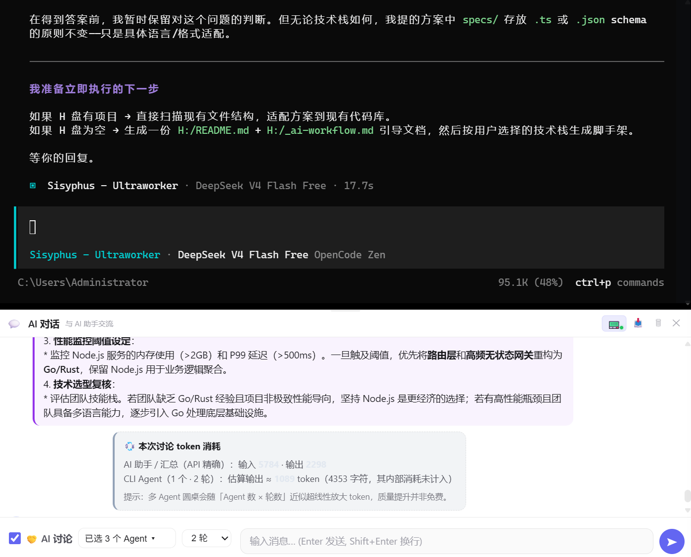

<p align="center">
  <strong>Hesi（合思）— 浏览器里的多 Agent 圆桌讨论平台</strong><br>
  <em>让多个 AI Agent 围一桌，多轮辩论你的代码 / 终端 / 浏览器任务</em>
</p>

<p align="center">
  <a href="https://github.com/qiuqiukof-oss/Hesi/blob/main/LICENSE"></a>
  <a href="https://github.com/qiuqiukof-oss/Hesi/releases"></a>
  <a href="https://github.com/qiuqiukof-oss/Hesi/stargazers"></a>
  <a href="https://nodejs.org/en/"></a>
  
</p>

<p align="center">
  <a href="https://3000-facbfa92d8b045f8ab3518837746fb77.e2b.ap-beijing.sandbox.cloudstudio.club/">▶ 在线体验圆桌 Demo（无需安装）</a> ·
  <a href="#-30-秒快速体验">🚀 30 秒上手</a> ·
  <a href="./README_en.md">English</a>
</p>

<p align="center">
  
</p>

<p align="center">
  <b>把浏览器变成你的 AI 协作中枢</b> — 选一个议题，让 AI 助手与 opencode / codex / aider 等 CLI Agent 围桌辩论、互相质疑、收敛方案。
</p>

---

> ⚠️ **安全警告**
>
> Hesi 可通过 WebSocket 执行任意终端命令、控制浏览器（CDP 集成）。
> **强烈建议仅在回环地址（`127.0.0.1` 与 `::1`）本地使用。如必须暴露到非本机网络，务必设置 `QCLI_ACCESS_TOKEN` 并阅读下方《安全部署》章节。**
> 公网部署且未启用鉴权可能导致远程命令执行（RCE）风险。

---

## 🚀 30 秒快速体验

| 你想… | 怎么做 |
|------|--------|
| 🖥️ **先看效果**（无需安装） | [▶ 在线体验圆桌 Demo](https://3000-facbfa92d8b045f8ab3518837746fb77.e2b.ap-beijing.sandbox.cloudstudio.club/) |
| 💻 **零安装试用**（推荐新手） | 下载 [v0.4.1 桌面托盘版](https://github.com/qiuqiukof-oss/Hesi/releases/tag/v0.4.1)，解压后双击 `tray.bat`（Windows）/ `./tray.sh`（macOS/Linux），浏览器自动打开 `http://127.0.0.1:4264` |
| 🛠️ **从源码运行**（开发者） | `git clone` → `npm install` → `npm run build` → `npm start`，打开 `http://127.0.0.1:4264` |
| 🤖 **让 AI Agent 围桌讨论** | 在「设置」里填入 `OPENAI_API_KEY` 或 `ANTHROPIC_API_KEY`，回到聊天框点「AI 讨论」，选 2–4 个 CLI Agent，输入议题 |

> 💡 首次打开不知道干什么？试试：**点「AI 讨论」→ 选 opencode + aider → 输入「帮我设计这个项目的日志模块」**，看它们怎么辩论。

📖 **完整新手指南**：[docs/getting-started.md](./docs/getting-started.md) ｜ 🧑‍💻 **贡献者指南**：[CONTRIBUTING.md](./CONTRIBUTING.md)

---

## ✨ 为什么选择 Hesi

- 🤝 **多 Agent 圆桌协作** — AI 助手与 opencode / codex / aider 等 CLI Agent 多轮辩论，互相质疑、补充、收敛方案，不再是单打独斗。
- 🛡️ **无头执行，互不串台** — CLI Agent 在后台无头运行，输出为干净纯文本；与你的交互终端彻底解耦，体验干净不打架。
- 🔒 **本地优先，可审计** — 所有会话、记忆、命令日志本地落盘；MIT 开源，自托管，开箱默认仅监听本机回环。

---

## 概述

**Hesi（合思）** 是一个基于 Web 的通用终端桥接平台。它将 `node-pty` + `xterm.js` 与 WebSocket 实时通信相结合，让你在浏览器中获得原生终端体验。在此之上集成了 AI 对话、Agent 管理、MCP 模块化服务、可视化面板、浏览器自动化等能力。

### 核心理念

| 理念 | 说明 |
|------|------|
| **一切皆 CLI** | 在浏览器中启动任意命令行工具，多标签独立运行 |
| **AI 原生** | AI 助手集成终端上下文感知 + 工具调用链（循环检测防失控） |
| **AI × CLI Agent 协作** | 让 AI 助手与 opencode / codex / aider 等 CLI Agent 多轮「圆桌讨论」，碰撞方案 |
| **模块化 MCP** | Model Context Protocol 服务，支持会话持久化、安全策略、审计日志 |
| **浏览器控制** | 通过 CDP 集成控制 Chrome/Edge，支持脚本注入、网络监控 |
| **可扩展** | 插件系统 + 预设模板 + 主题定制器 + 自定义 CSS 注入 |

---

## 命名由来

**合思（HeSi）** —— 一个名字，两层巧思。

**中文**
- **合** — 协作与结合：多个 Agent 汇聚一处，中西工具生态在此对接。
- **思** — 思考与灵感：AI 的智力活动，也是那一闪而过的念头。
- 合起来，「合思」谐音「巧合的灵思」，带一点"神来之笔"的意外之喜。两个字，过目不忘。

**English**
- **HeSi** — four letters, one keystroke away in your terminal. A name built for the CLI.
- **He** + **Si**（拼音「思」）恰好读作 *"He thinks"* —— 一个会思考的伙伴，纯属美妙的巧合。
- 元音结尾，念起来顺口。

> 一句话：**合思，是让多个 AI「合」在一起「思」考的地方。**
> *Hesi is where multiple minds meet to think — together.*

---

<details>
<summary>📦 顺带还能干 — 完整功能清单</summary>

## 主要功能

### 🖥️ 多会话终端

- **xterm.js + WebGL 渲染** — 流畅的终端输出，支持 WebGL 和 Canvas 双渲染后端
- **多标签页管理** — 每个标签独立 PTY 进程，互不干扰，支持拖拽排序和置顶
- **终端内搜索** — Ctrl+Shift+F 在终端输出中搜索，支持上下导航
- **链接识别** — 自动识别文件路径、URL，点击可在浏览器预览
- **自适应宽高** — 通过 FitAddon 自适应容器大小
- **会话持久化** — IndexedDB 存储终端内容，关闭页面后恢复
- **字体调整** — Ctrl+= / Ctrl+- 实时调整，支持 8-32px 范围

### 🔍 CLI 自动发现与预设

- **PATH 扫描** — 自动扫描系统中的可执行文件，生成快捷启动列表
- **预设系统** — 内置开发者、数据科学家、系统管理员、媒体工程师等多套预设
- **预设继承** — 预设支持 `extends` 链式继承，共享基础配置
- **缓存加速** — 24 小时磁盘缓存，避免每次启动重复扫描
- **版本检测** — 自动检测 CLI 版本号（尝试多种 flag：`--version`, `-v`, `-V`）
- **类型分类** — 自动判断 interactive/batch 类型，支持自定义分类
- **文件夹组织** — 支持创建文件夹分组管理，拖拽归类
- **收藏夹** — 左侧栏可收藏常用 CLI；讨论模式的 Agent 下拉与收藏夹**自动同步**（收藏项默认勾选、置顶、★ 标记）

### 🤖 AI 集成

- **多提供商** — 支持 OpenAI、Anthropic、LM Studio（本地模型）
- **SSE 流式输出** — 结构化事件类型（token/status/error/tool_call/usage），120s 空闲超时保护（可配 `HESI_LLM_STREAM_IDLE_MS`）
- **终端上下文感知** — 自动捕获终端最新 100 行输出作为 system message
- **增量上下文裁剪** — 仅发送变化的增量行，节省 token
- **工具调用链** — 连续工具调用含循环检测（环检测 + 窗口去重 + 硬上限），防止「瞬间打满上限」式失控；深度思考面板以实时工具卡片呈现（运行中 → 完成时长 + 结果预览，XSS 安全）
- **轻量自检** — 识别「全面自检 / 自检」意图，自动将工具轮次上限压至 6 轮，显著减少冗余 LLM 调用
- **工具集** — 文件读写、Web 搜索、终端执行、文档转换、图像/视频生成
- **浏览器控制工具** — 导航、截图、点击、输入、执行 JS、DOM 快照、表单填表
- **自我进化** — 可读取/修改自身源码、重建前端、截屏检查 UI

### 🧠 跨会话记忆

> 让 AI 记得你：对话不再随刷新/重启丢失，且能**跨会话召回**过去聊过的事实。

- **服务端持久化** — 每次对话以「会话」为单位存于 `data/memory/`（不依赖浏览器 localStorage，刷新/重启后仍可恢复）。
- **左栏会话列表** — 聊天面板左侧新增会话栏：新建 / 续聊 / 搜索 / 双击改名 / 删除；按「今天 / 昨天 / 过去 7 天 / 更早」分组。
- **🧠 记忆抽屉** — 顶部 🧠 按钮打开，展示**自动生成的用户画像**与**已记住的事实**，每条事实可「遗忘」。
- **自动摘要压缩** — 长会话超过阈值时自动压缩为 `<session_summary>`（保留决策/事实/偏好），腾出上下文；LLM 不可用时降级为保留原文。
- **BM25 召回** — 每次提问自动检索相关历史会话与事实，作为 `<memory>` 块注入 AI 上下文（零依赖、纯本地、可离线）。
- **用户画像 / 事实（Layer A）** — 淡出稳定事实（偏好、项目、身份），去重累计置信度，蒸馏成 `profile.md`；可查看、可遗忘。
- **可降级开关** — 环境变量 `HESI_MEMORY_ENABLED=0` 时整个子系统关闭，聊天退回原 localStorage 行为，**零行为变化**。
- **旧历史迁移** — 首次升级时自动把浏览器旧 `localStorage['qcli-chat-history']` 导入为首条会话；也可用 `node scripts/memory-migrate.js --file legacy.json` 离线导入。

> 隐私：所有记忆均在 `data/memory/` 本地，不外接任何云；`facts.json` / `profile.md` 用户可手动编辑或删除。

### 🤝 AI 助手 × CLI Agent 协作讨论（圆桌）

> 本功能是 Hesi 的核心协作场景：让「AI 助手」与一个或多个「CLI Agent（如 opencode）」就同一问题展开**多轮讨论**，互相质疑、补充、细化方案。

- **多选讨论伙伴** — 在聊天面板点「讨论」按钮，从已发现的 CLI Agent 中多选（最多 4 个）作为讨论对象
- **多轮迭代** — 支持配置讨论轮次（rounds），AI 助手与 Agent 交替发言，逐轮收敛
- **增量抽取** — 每轮只把 Agent 的**新增输出**喂给 AI（防止同一段文本重复塞满上下文）
- **收藏夹同步** — 讨论下拉合并 `/api/agents` 与 `/api/clis`，并读取左侧栏收藏夹，**收藏项默认勾选、置顶、带 ★**
- **超时与清理** — 单 Agent 会话 5 分钟超时自动终止，已完成会话 5 分钟 TTL 后清理

### 🛡️ CLI Agent 渲染治本

> 全屏 TUI 的 CLI Agent（如 **opencode**）在 PTY 中会绘制 ASCII 界面/状态条，其渲染帧是字面文本，剥掉转义后只剩碎片，会污染喂给 AI 的讨论文本（表现为「陷入界面渲染，未提供实质分析」）。

- **headless 子命令** — 对声明了 headless 模式的 Agent，改用非交互子命令并通过 **stdin 管道**注入任务（非 TTY，从源头杜绝 TUI），输出为干净纯文本
- **多 CLI 支持** — `lib/cli-headless.js` 的 `HEADLESS` 映射当前内置四种（均经实测、任务提示统一走 stdin，绝不拼进 argv）：`opencode`（`opencode run`）、`claude`（`claude -p`）、`codex`（`codex exec -`）、`aider`（`--yes-always --no-auto-commits --no-pretty --no-stream`）；新增其它 CLI 只需补一条描述
- **Windows 安全要点** — headless 执行在 Windows 上以 `shell:true` 启动，argv 会被重新分词，因此**多行/含引号的提示词必须经 stdin 注入**（已由 `test/cli-headless.test.js` 用含 `"`/换行/`rm -rf` 的恶意提示回归覆盖）
- **回退兼容** — 未声明 headless 的 Agent 仍走 PTY + 转义清洗（`lib/terminal-clean.js`），行为不变
- **TUI 保留** — 人工交互终端（`ws/agent.js`）与工作流（`ws/orchestrator.js`）的 TUI 完整保留，不受影响

### 🌐 浏览器控制（CDP）

- **自动连接** — 检测 Chrome/Edge CDP 端口（默认 `localhost:9222`）
- **页面操作** — 导航、前进后退、刷新、截图、执行 JS
- **元素交互** — 点击、输入、悬停、滚动
- **控制台监控** — 实时获取浏览器控制台日志
- **标签页管理** — 列出/切换所有浏览器标签页
- **浏览器农场** — 多个隔离浏览器会话并行管理
- **用户脚本** — 注入自定义 JS 脚本在指定 URL 模式自动执行
- **DOM Diff** — DOM 快照对比，跟踪页面变化
- **表单自动填表** — 自动检测和填写表单字段
- **无障碍分析** — 页面无障碍问题检测
- **网络监控** — 实时捕获 HTTP/请求/响应，支持 HAR 导入导出

### 📄 文档格式转换

- **AI 驱动** — 通过 `convert_document` 工具在 AI 对话中直接转换
- **多格式支持** — PDF / DOCX / PPTX / HTML / EPUB / LaTeX / RST / Markdown
- **Pandoc 驱动** — 自动检测系统 pandoc，支持 `PANDOC_PATH` 环境变量
- **智能降级** — 无 pandoc 时自动使用内置 Markdown→HTML 转换器

### 🔌 MCP 服务器

- **模块化架构** — `mcp/` 目录含工具、资源、安全、会话管理子模块
- **会话管理** — `SessionManager` + `RingBuffer` + TTL 自动过期
- **安全层** — Bearer 鉴权 + 审计日志 + YAML 策略文件
- **缓存层** — LRU 缓存 + METRIC 统计 + 心跳报告
- **AI 桥接** — MCP → OpenAI Function Calling 转换
- **自动重启** — 健康检查 + 指数退避重启
- **速率限制** — Token Bucket 算法，防止工具调用风暴
- **输出截断** — 工具结果自动截断（4K 字符上限）

### ✅ 代码质量与安全

- **PTY 环境变量过滤** — 自动过滤 API_KEY/TOKEN/PASSWORD 等敏感模式
- **双层限流** — 全局 API 限流 + WebSocket 消息限流 + 上传限流
- **回归测试** — 终端清洗、讨论协调器、稳定性（工具中断/限流/流完结/环检测）三层验证
- **Prettier + ESLint** — 代码统一格式化 + lint-staged 提交前检查

### 📊 可视化面板

- **仪表盘** — 系统状态、CLI 统计、资源监控
- **股票分析 / 量化交易 / 财务预算** — 实时行情、策略回测、收支统计
- **媒体管理** — 图片/视频/PDF 浏览器预览
- **MCP 监控** — 实时事件频率图、工具调用分布、增量事件日志
- **限流状态** — 实时显示各路由请求频率和 429 命中次数
- **插件管理 / 插件广场** — 启用禁用、热重载、发现社区插件

### 🎙️ 交互体验

- **命令面板** — Ctrl+K 快速搜索 CLI 和操作
- **语音输入 / 输出** — Web Speech API 输入；TTS 朗读 AI 回复
- **主题定制器** — 内置预设 + 自定义保存
- **多语言界面** — 中文 / English 即时切换
- **通知系统** — Toast 通知 + 通知中心
- **自定义 CSS** — 实时注入自定义样式
- **欢迎轮播** — 首次使用的引导介绍

</details>

---

## 快速开始

### 系统要求

| 项目 | 要求 |
|------|------|
| **Node.js** | >= 18.0.0 |
| **npm** | >= 9.0.0 |
| **操作系统** | Windows / macOS / Linux |

### 安装

```bash
git clone https://github.com/qiuqiukof-oss/Hesi.git
cd Hesi               #（需解压便携node至目录）
npm install
npm run build          # 生产构建前端（输出 public/bundle.js）
npx playwright install chromium   # 可选，浏览器控制功能
cd Hesi/tray
npm install
```

### 启动

```bash
npm start              # → http://localhost:3001（默认监听 127.0.0.1 与 ::1）
npm run dev            # 开发模式（热重载）
npm run mcp            # 独立启动 MCP 服务
```

### 环境变量

| 变量 | 默认值 | 说明 |
|------|--------|------|
| `PORT` | `3001` | HTTP 服务端口 |
| `HOST` | `loopback` | 监听地址；设为 `0.0.0.0` 会打印高危警告 |
| `OPENAI_API_KEY` / `ANTHROPIC_API_KEY` | — | 各 LLM 提供商 Key（可选） |
| `STABILITY_API_KEY` / `BING_SEARCH_API_KEY` / `TAVILY_API_KEY` | — | 图像/搜索 Key（可选） |
| `PANDOC_PATH` | — | Pandoc 路径（可选，文档转换） |
| `QCLI_ACCESS_TOKEN` | `""` | 访问令牌；设置后所有敏感 `/api` 与 WebSocket 需鉴权（loopback 默认豁免） |
| `QCLI_TOKEN_REQUIRE_LOOPBACK` | `""` | 设为 `1` 时即使本机回环也强制令牌 |
| `QCLI_CORS_ORIGINS` | `""` | 逗号分隔的跨域白名单 |
| `QCLI_POLICY_PATH` | `""` | MCP 安全策略文件（默认 `blocklist`） |
| `QCLI_WITH_MCP` / `QCLI_MCP_TOKEN` | `""` | 自动启动 MCP / MCP Bearer 令牌 |
| `QCLI_AUDIT_LOG` | `""` | MCP 审计日志路径 |
| `QCLI_SESSION_TTL` | `900000` | 会话闲置过期（ms） |
| `QCLI_MAX_SESSIONS` | `10` | 最大并发会话数 |

> 💡 完整变量参见 `./.env.example`

---

## 桌面托盘版（离线便携包）

Hesi 也提供**开箱即用的离线智能体包**：自带便携 Node.js，无需安装，双击即可启动。

```text
Windows：双击 tray.bat
macOS  ：在终端运行 ./tray.sh（首次需 chmod +x tray.sh）
Linux  ：在终端运行 ./tray.sh
```

- 启动后托盘出现 Hesi 图标，并自动打开 `http://127.0.0.1:4264`
- 欢迎页点「AI 智能体（一键安装）」即可离线安装 OpenCode / Codex 等
- 托盘菜单：打开 Hesi / 打开（CDP 模式）/ 停止服务 / 退出
- 默认仅绑定本机回环地址，不会暴露到局域网
- macOS「无法验证开发者」：`xattr -dr com.apple.quarantine .` 后重试
- 端口被占用：设置 `PORT` 环境变量换端口

---

## 架构概览

```
├── server.js              # Express 入口 + 静态文件服务
├── ws-handler.js          # WebSocket 连接管理 + PTY（核心终端逻辑）
├── cli-discovery.js       # CLI 自动发现引擎（含磁盘注册表 cli-registry.json）
├── cli-registry.json      # CLI 注册表（agent 列表 / 收藏来源，运行时持久化）
├── preset-loader.js       # 预设加载器
├── rate-limiter.js        # API 限流
├── ring-buffer.js         # 环形缓冲区
├── mcp-server.js          # MCP sidecar 入口
├── mcp/                   # 模块化 MCP 架构（tools/resources/security/session）
├── ws/                    # WebSocket 子系统
│   ├── pty.js             # PTY 创建抽象 + createHeadlessExec（headless Agent 执行）
│   ├── pty-policy.js      # PTY 策略引擎
│   ├── message-dispatch.js # WebSocket 消息路由
│   ├── agent.js           # 人工交互 Agent 终端（保留 TUI）
│   ├── orchestrator.js     # 工作流编排（保留 TUI，支持单 ws 并发多 workflow）
│   ├── digital-employee.js       # 数字员工团队（角色/人设/任务派发）
│   ├── digital-employee-worker.js # 数字员工任务执行器（复用 agentPool，真实跑任务）
│   └── context-store.js    # 共享上下文存储
├── routes/                # RESTful API 路由
│   ├── chat/              # AI 聊天 + discuss（AI × CLI Agent 圆桌）
│   ├── ai-tools/          # Agent 池（agent-pool.js）+ 同步委派（builtin/agent.js）
│   ├── clis.js / agents.js # CLI / Agent 发现（含 category，支撑收藏夹同步）
│   └── ...                # 其余路由
├── lib/
│   ├── cli-headless.js     # headless Agent 描述表（opencode/claude/codex/aider，均 stdin 注入）
│   ├── asset-hash.js       # bundle.js/lazy-bundle.js 内容哈希（?v= 缓存击穿）
│   ├── terminal-clean.js   # TUI 转义清洗（CSI/OSC/裸 ESC 流式清洗）
│   ├── env-filter.js       # PTY 环境变量过滤
│   ├── access-auth.js      # 可选访问令牌鉴权
│   └── mcp-process.js      # MCP 子进程管理
├── public/                # 前端静态资源（bundle.js 由 esbuild 构建）
├── cli-presets/           # CLI 预设配置
├── workflows/             # 预设工作流编排
├── plugins/               # 插件系统
├── tray/ + tray.bat/tray.sh  # 桌面托盘版启动器（离线便携包）
└── node/                  # 便携 Node.js 运行时（离线包用）
```

---

## 技术栈

| 层 | 技术 |
|----|------|
| **后端** | Node.js + Express |
| **终端** | node-pty + xterm.js + WebGL |
| **通信** | WebSocket (ws) + SSE |
| **构建** | esbuild |
| **AI** | OpenAI API / Anthropic API |
| **浏览器控制** | Playwright + CDP |
| **存储** | IndexedDB + safeStorage |
| **代码质量** | ESLint + Prettier + Husky |
| **测试** | node --test + plans/ 回归套件 |
| **文档** | OpenAPI 3.0 + JSDoc |
| **语音** | Web Speech API |
| **图表** | 自研 Canvas 引擎 (ChartCore) |

---

## 测试

回归套件位于 `plans/`（纯 Node 脚本，无需框架）：

```bash
node plans/verify-terminal-clean.js          # 终端转义清洗（9 项）
node plans/test-discuss.js                  # 讨论协调器模块契约回归（7 项：加载/导出/形状/异步/arity/缓存）
node plans/test-stability-regression.js     # 稳定性回归（37 项：工具中断/限流/流完结/环检测）
```

语法与结构检查：

```bash
npm run check:server    # 全部服务端模块 node --check 语法检查
npm run lint            # ESLint
```

---

## 脚本命令

| 命令 | 说明 |
|------|------|
| `npm start` | 启动生产服务 |
| `npm run dev` | 开发模式（`--watch` 热重载） |
| `npm run build` | 构建前端（esbuild 压缩，产出 public/bundle.js） |
| `npm run build:dev` | 开发构建（含 sourcemap） |
| `npm run watch` | 前端监听模式 |
| `npm run mcp` | 独立启动 MCP 服务 |
| `npm run check:server` | 服务端模块语法检查 |
| `npm run lint` / `npm run format` | ESLint / Prettier |

---

## 贡献指南

欢迎贡献！无论是功能请求、Bug 报告还是代码 PR。完整指南（含构建坑、husky 钩子、gh-pages 流程、bundle 双轨陷阱）见 **[CONTRIBUTING.md](./CONTRIBUTING.md)**。

### 开发流程

```bash
git clone <your-fork>
cd Hesi
npm install
npm run dev
npm run build
```

### 代码规范

- 后端：CommonJS (`require`/`module.exports`)
- 前端：ESM (`import`/`export`)，通过 esbuild 打包
- 新功能请附带回归测试（置于 `plans/`）

---

## 安全部署

Hesi 本质上是一个 **本地优先（local-first）** 的终端/浏览器中枢：它通过 WebSocket
执行任意命令、通过 CDP 控制浏览器。因此默认配置以「最小暴露面」为原则，开箱即用偏安全。

### 关于 `npm audit` 警告

`npm install` 后 `npm audit` 可能报告若干漏洞（含一个 `@hono/node-server` 的 moderate）。这些来自 **`@modelcontextprotocol/sdk` 的间接依赖**，Hesi 自身使用 **Express** 服务器，**不调用 Hono 的 `serve-static`**；且服务**仅监听本机回环**，不暴露公网。因此该路径为未被调用的死代码，**对本地部署无实际影响**，属供应链层面的误报，无需处理。其余可直接修复的漏洞已通过 `npm audit fix`（非 `--force`）升级到兼容版本。

### 默认安全姿态（开箱即用）

| 项 | 默认行为 |
|----|----------|
| 监听地址 | 回环地址 `127.0.0.1` 与 `::1`（仅本机）。设 `HOST=0.0.0.0` 会打印高危警告 |
| CORS | 仅允许同源/回环；跨域需 `QCLI_CORS_ORIGINS` 显式白名单 |
| 访问令牌 | 未设置 `QCLI_ACCESS_TOKEN` 时关闭；设置后所有敏感 `/api` 与 WebSocket 需令牌 |
| 命令策略 | `blocklist` 模式，内置危险命令黑名单；可 `QCLI_POLICY_PATH` 覆盖 |
| 限流 | 全局 API + WebSocket 消息 + 上传限流；**本地回环默认豁免** |
| 终端隔离 | node-pty 若未编译，PTY 功能优雅降级 |
| 上传目录 | 用户上传写入 `uploads/.user/`（隐藏，鉴权后可读） |

### 公网 / 多人部署清单

> ⚠️ 仅在满足以下全部条件时才暴露到非本机网络。

1. **设置访问令牌**：`QCLI_ACCESS_TOKEN=<strong-random-token>`，HTTP 头 `Authorization: Bearer <token>`，WebSocket 追加 `?token=<token>`
2. **收紧 CORS**：`QCLI_CORS_ORIGINS=https://your-frontend.example.com`
3. **强化命令策略**：通过 `QCLI_POLICY_PATH` 指向 `blocklist`/`allowlist` 策略，或收紧为 `allowlist`
4. **MCP 鉴权**：`QCLI_MCP_TOKEN` + 保持 `QCLI_AUDIT_LOG` 开启
5. **反向代理**：前置 Nginx/Caddy 启用 HTTPS/HSTS，限制 `/api/uploads` 来源
6. **切勿以 root 运行**，定期更新依赖

### 安全基线自检

```bash
[ "$HOST" = "0.0.0.0" ] && echo "WARN: HOST=0.0.0.0 exposes all interfaces" || echo "OK: loopback by default"
[ -n "$QCLI_ACCESS_TOKEN" ] && echo "OK: access token set" || echo "WARN: no access token"
```

---

## 许可证

MIT License — see [LICENSE](./LICENSE) for details.

<p align="center">
  <sub>Built with ❤️ by Hesi Contributors</sub>
</p>
